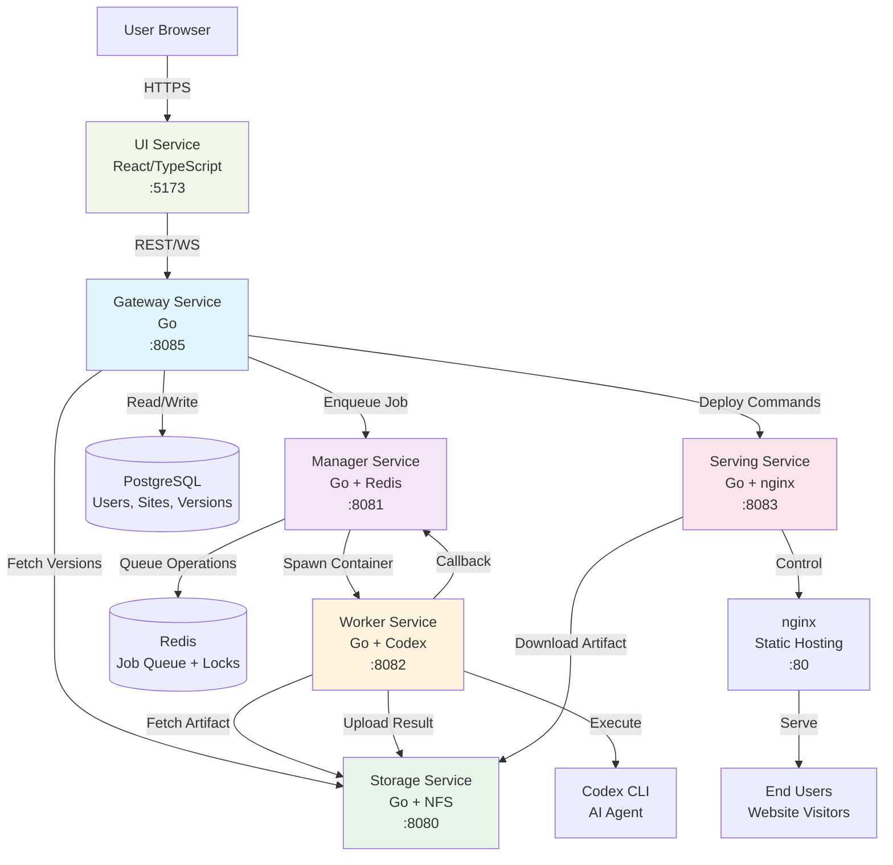

# PageWrightCloud Architecture

## System Overview

PageWrightCloud is a distributed platform for AI-powered static website creation and management. The system uses a microservices architecture with isolated concerns for authentication, job orchestration, artifact storage, AI-based editing, and web serving.

## Architecture Diagram



## Service Responsibilities

### Gateway (Port 8085)
**Purpose**: User-facing API gateway

- User authentication (JWT, OAuth2)
- Site CRUD operations
- Version management
- Domain alias configuration
- WebSocket connections for real-time updates
- Build request orchestration

**Database**: PostgreSQL (users, sites, site_aliases, versions)

### Manager (Port 8081)
**Purpose**: Job queue and worker orchestration

- Job creation and queuing
- Distributed locking per site (Redis)
- Fencing tokens to prevent stale writes
- Worker spawning (Docker/Kubernetes)
- Job status tracking and callbacks

**Storage**: Redis (job queue, distributed locks)

### Storage (Port 8080)
**Purpose**: Artifact versioning and retrieval

- Store/fetch site artifacts (tar.gz)
- Write structured log entries
- List version history
- Atomic write operations

**Storage**: NFS mount (pluggable backends planned: S3, Azure Blob)

### Worker (Port 8082)
**Purpose**: AI-powered site editing

- Fetch artifact from storage
- Unpack and patch Codex instructions
- Execute `codex exec <prompt>`
- Parse AI output (files changed, summary)
- Pack results and upload
- Callback to manager with completion status

**Dependencies**: Codex CLI, OpenAI API

### Serving (Port 8083)
**Purpose**: Static site hosting controller

- Deploy artifacts to release directories
- Manage symlinks (public, preview)
- Generate nginx configurations
- SIGHUP reload for zero-downtime updates
- Version cleanup (retain last N)
- Per-site enable/disable (maintenance mode)

**Dependencies**: nginx (port 80)

### UI (Port 5173)
**Purpose**: User interface

- Chat-based site editing
- Site dashboard and management
- Version history browser
- Real-time build status updates
- Profile and authentication pages

**Framework**: React + TypeScript + Vite

## Data Flow

### Site Creation
1. User submits site creation form (UI → Gateway)
2. Gateway creates database record with FQDN
3. Gateway requests artifact deployment (Gateway → Serving)
4. Serving fetches template artifact (Serving → Storage)
5. Serving unpacks and configures nginx
6. Site is live

### Site Edit (Build)
1. User sends chat message (UI → Gateway via WebSocket)
2. Gateway enqueues build job (Gateway → Manager)
3. Manager acquires site lock (Redis)
4. Manager spawns worker container (Docker/K8s)
5. Worker fetches current artifact (Worker → Storage)
6. Worker executes Codex with user prompt
7. Worker uploads result artifact (Worker → Storage)
8. Worker reports completion (Worker → Manager)
9. Manager releases lock
10. Gateway notifies UI via WebSocket

### Version Promotion
1. User clicks "Promote to Live" (UI → Gateway)
2. Gateway instructs serving to activate version (Gateway → Serving)
3. Serving updates `public` symlink
4. nginx serves new version (atomic switch)

## Storage Patterns

### Artifact Storage (NFS)
```
/nfs/sites/
  └── {site_id}/
      ├── artifacts/
      │   ├── {build_id}.tar.gz
      │   └── {build_id}.tar.gz
      └── logs/
          ├── {build_id}.json
          └── {build_id}.json
```

### Serving Storage (Local Filesystem)
```
/var/www/{domain}/{fqdn}/
  ├── artifacts/
  │   ├── v1-20240101/
  │   └── v2-20240102/
  ├── public -> artifacts/v2-20240102/public
  └── preview -> artifacts/v1-20240101/public
```

## Security Model

### Authentication
- JWT tokens (15-min expiry, configurable)
- Google OAuth2 integration
- bcrypt password hashing (cost factor 10)

### Authorization
- User ID in JWT claims
- Ownership validation on all operations
- Database foreign key constraints

### Network Isolation
- Internal services not exposed to internet
- Gateway is the only public-facing service
- Worker containers isolated per job

### Data Integrity
- Atomic writes (temp + fsync + rename)
- Distributed locks prevent concurrent modifications
- Fencing tokens prevent stale updates

## Scalability Considerations

### Horizontal Scaling
- **Gateway**: Stateless, scales behind load balancer
- **Manager**: Single instance per Redis (lock coordination)
- **Storage**: Single instance (NFS bottleneck)
- **Worker**: Unlimited parallel containers (per-site locked)
- **Serving**: Single instance per host (nginx constraint)

### Bottlenecks
- Redis: Single point of coordination
- NFS: I/O throughput for storage operations
- nginx: Reload operations during high-frequency updates

### Future Improvements
- Manager clustering with Redis Cluster
- Object storage backend (S3) for storage service
- CDN integration for serving (CloudFlare)
- Worker pool pre-warming

## Failure Modes

### Worker Crash
- Lock expires (TTL-based)
- Job marked as failed
- User can retry

### Storage Unavailable
- Gateway caches version list (planned)
- Worker retries with exponential backoff
- Serving uses last known good configuration

### Manager Down
- Jobs queue in Redis (persistent)
- Gateway continues accepting requests
- Workers cannot report completion (callbacks fail)

### Serving/nginx Down
- Sites become unavailable
- No data loss (artifacts in storage)
- Redeploy from storage on recovery

## Monitoring Points

- Gateway: Request rates, auth failures, WebSocket connections
- Manager: Queue depth, lock contention, worker spawn times
- Storage: Upload/download throughput, disk usage
- Worker: Execution time, Codex API latency, failure rates
- Serving: nginx reload frequency, active sites, traffic per site
